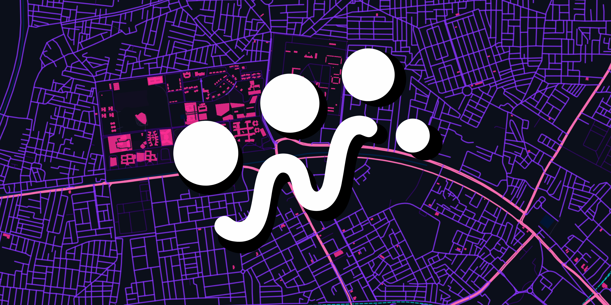

# CivicPulse

### Building Intelligence for Better Cities

**Urban Intelligence · Research · Spatial Technologies · Digital Experiments**

<a href="https://civicpulsehq.xyz/">Website</a> ·
<a href="https://www.linkedin.com/company/civicpulsehq/">LinkedIn</a> ·
<a href="https://github.com/CivicPulsehq">GitHub</a> ·
<a href="https://www.instagram.com/civicpulse.hq/">Instagram</a>

---

## About

**CivicPulse** is an urban intelligence initiative exploring the intersection of **civil engineering, urban planning, spatial technologies, research, and data-driven approaches to cities**.

It brings together projects, research, digital tools, spatial experiments, and writing focused on understanding and building better urban systems.

---

## The Ecosystem

| Area | Focus |
| --- | --- |
| **LAB** | Digital experiments, web apps, maps, visualizations, games, and technical prototypes |
| **INTELLIGENCE** | Spatial and data-driven platforms for urban and infrastructure challenges |
| **STUDIO** | Urban research, historical inquiry, spatial analysis, and visual exploration |
| **JOURNAL** | Research notes, field observations, ideas, experiments, and technical writing |

---

## Current Projects

### MOSAIC
**Urban Spatial Intelligence Platform**

An interactive Web GIS project exploring urban spaces through mapping, pedestrian navigation, walkability analysis, and spatial data.

**Status:** In development

### PALIMPSEST
**Urban History & Spatial Research**

A research initiative exploring historical layers, spatial transformations, and contemporary conditions through urban history and geospatial inquiry.

**Status:** Research phase

---

## Journal

The **CivicPulse Journal** documents research notes, field observations, technical explorations, and ideas around cities and infrastructure.

Topics include:

**Urban Systems · Infrastructure · GIS & Remote Sensing · Transportation · Climate Resilience · Spatial Research · Engineering · Digital Experiments**

---

## Lab

The **CivicPulse Lab** is the experimental side of the platform — where ideas become things that can be built, mapped, tested, and interacted with.

Projects may include:

- Remote sensing applications
- Interactive GIS / Web GIS projects
- Spatial visualizations
- Digital tools
- Small games and experiments
- Data-driven prototypes

---

## Technology

`QGIS` · `Python` · `JavaScript` · `Mapbox` · `Streamlit` · `Google Earth Engine` · `GitHub`

The technology stack varies across projects.

---

## Our Team

### Priyanshu Joshi

**Platform Lead · CivicPulse**

Civil Engineering · Thapar Institute of Engineering & Technology  
Patiala, India

**Interests:** Urban Planning · GIS & Remote Sensing · Infrastructure · Transportation · Climate Resilience · Spatial Research · AI & Data

**Currently:** Academic Research Intern — Global URBAN HEAT Media Lab, Pedestrian Space

**Recognition:** Innovation Award Winner — AI for Sustainability Hackathon 2026, Canadian University Dubai

**Research:** *Density, Infrastructure Performance and Livability: A Comparative Study of Kowloon Walled City and Dharavi* — comparative research on urban density, infrastructure adaptability, and livability.

<a href="https://www.linkedin.com/in/priyanshu-joshi-tiet/">LinkedIn →</a>

---

## Repository

This repository contains the source for the **CivicPulse website**.

It serves as the digital home for CivicPulse's projects, research, experiments, and writing.

### CivicPulse

**Building Intelligence for Better Cities**

<a href="https://civicpulsehq.xyz/">civicpulsehq.xyz</a>

